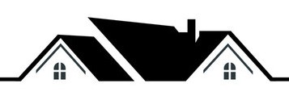

# SUA CASA

A **Sua Casa** é uma plataforma imobiliária, que facilitando o contato com o cliente atráves de suas funcionalidades.

Principais funcionalidades:
- **Listagem de propriedades**: traz todas as propriedades cadastradas;
- **Cadastro de visitas**: marcação de visita para uma determinada propriedade;
- **Listagem das visitas**: lista as visitas de cada propriedade.

---
## Implementação das funcionaidades
- [x] Listagem de propriedades;
- [x] Cadastro de visitas;
- [x] Listagem das visitas;
- [ ] Cadastro de propriedade;
- [ ] Exclusão de uma propriedade;
- [ ] Exclusão de uma visita;
- [ ] Autenticação;
- [ ] Fluxo de Compra e Venda.

---
## Tecnologias
- **HTML**: linguagem de marcação para a criação da página;
- **CSS**: estilização da pagina;
- **JavaScript**: iteração e consumo dos recursos da API.

---
## Execução da Api

Basta copiar o endereço (path) do arquivo `index.hmtl` e colar na barra de navegação de qualuer navegador.